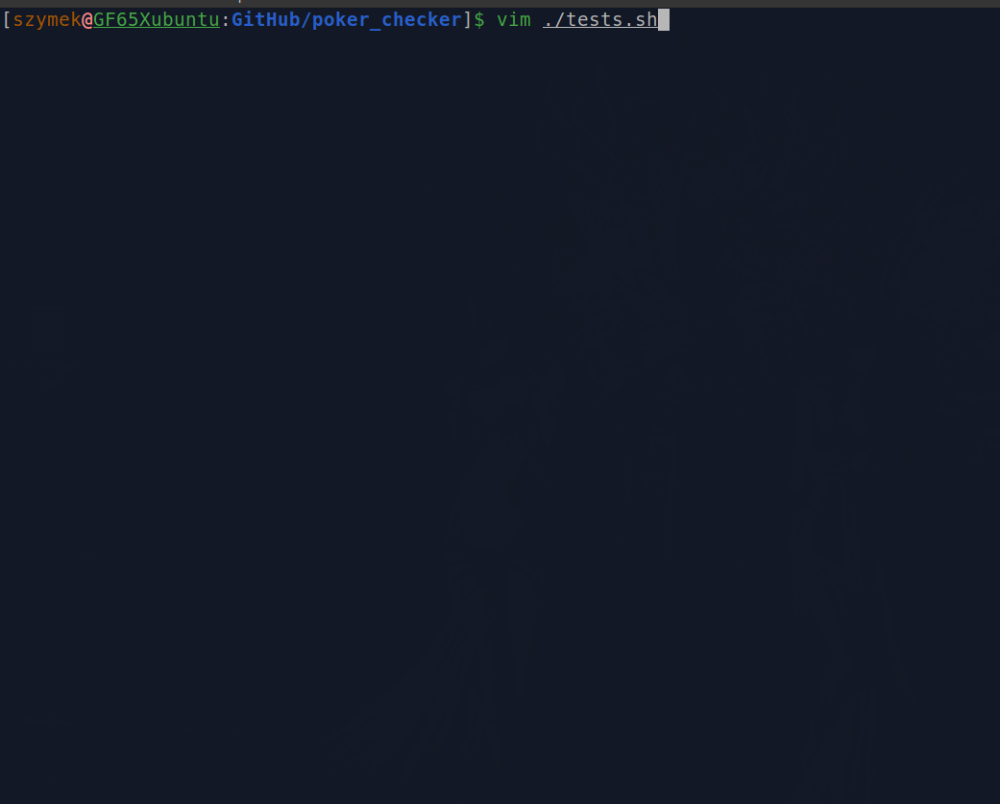

# poker_checker
This script receives two arguments from CLI and decide which is better based on poker rules

For start run following commands
1. `npm install`
2. `npm run start <firstHand> <secondHand>`
  e.g.
  * `npm run start TTT4T TTT4T`
  * `npm run start 444AT 33JJ3`
  * `npm run start AA3A9 QQ3Q9`
  * `npm run start KQ236 6K2Q3`

Here you can see how it works: 
